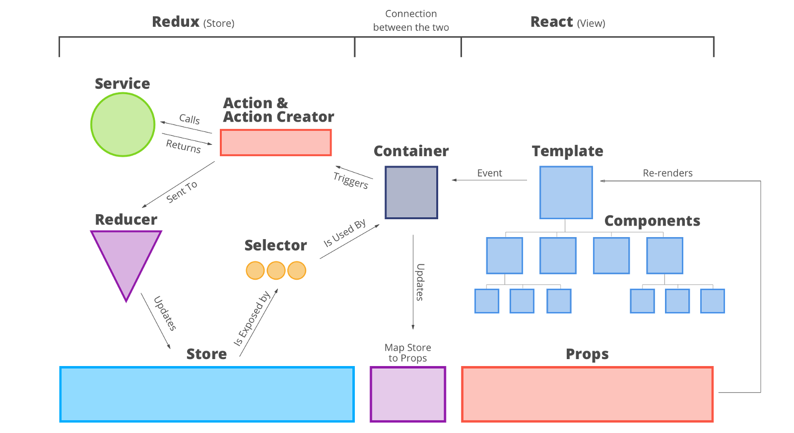

# A brief history of the web

::: notes
- motivation is to give a bit of context for client side web apps
- why has the industry settled on this methodology
- while writing this, young age of the modern web was put into perspective
:::

## Generation 1

Server rendered web pages

MVC becomes the de facto architecture

- 1995 - PHP
- 2005 - Ruby on Rails
- 2005 - Django

::: notes
- server responsible for rendering every page
- tight coupling between the backend and ui
  - monolithic
- MVC becomes the de facto architecture
:::

## Generation 1

::: notes
- relatively simple data flow
- request is routed through the controller
- model is queried
- view is sent in response
:::

## Generation 2

Client side apps

::: {.columns}
::: {.column width="50%"}
#### Web server frameworks
- 2010 - Flask
- 2010 - Express.js
:::
::: {.column width="50%"}
#### Client side web frameworks
- 2010 - Backbone.js
- 2011 - AngularJS
- 2011 - Ember.js
:::
:::

::: notes
- web browsers became more powerful
  - we begin to think about the browser as a platform itself
  - js became ubiquitous
- work from the server was offloaded to the client as a result
- server side dynamic was changing
  - microservices, approx 2005 - Borg, 2010 - Mesos, 2012 - Eureka / Hystrix
- required the view to be separate from the server side logic
- idea of a SPA was created as entire web apps could be created from a single
  page
  - MVC architecture on the front end
  - client side routing
:::

## Generation 2

::: notes
- unlike server side mvc, model is backed by a server over the network
:::

## Generation 2 - Problems

- Traditional MVC does not scale on the client side
- State management is complex
  - the model and view may be desynchronized
  - user actions may have a significantly greater amount of effects

::: notes
- MVC client side apps are difficult to maintain
  - do not scale
  - cannot use the same approach as with completely server rendered apps
  - not just a single output of html to the browser
- in particular state management becomes overly complex
  - need to ensure that the view reflects the model
  - effects of a user action may be numerous
    - e.g. entering a comment on a post of a hypothetical website
    - add a comment to the list of comments
    - update the comment count of the post
    - show that you are now following the post
:::

## Generation 2 - Problems

::: notes
- a certain change in the model could have many side effects
- AngularJS was notorious for being non-performant, because of dirty checking
  to keep the model and view in sync
:::

# Generation 3

::: notes
- due to the fast pace of the web, solutions were quickly created
:::

## React

- Kickstarted the componentization craze
  - Focused on reusability
- View should be a function of app state
  - Virtual DOM

::: notes
- FB 2013
- no longer thinking in terms of templating or pages
  - breaking down an app into reusable components
- key principle is view is a pure function of the application state
  - implemented using a virtual dom
  - solves the issue that the view always needs to reflect the current model
:::

## React - Virtual DOM

::: notes
- virtual dom is a representation of the current dom in js
  - when a change is made, the vdom is updated
  - the vdom is diffed against its previous version
  - all the changed nodes get updated in the dom
- gives react a performance advantage
  - expensive dom manipulations are minimized
:::

## Redux

- De facto state management framework for React
- "One way data flow"

::: notes
- one way data flow architecture
  - mvc done right
  - solves the issue of a spiderweb of dependencies
:::

## Redux

::: notes
- since react is a function of state, redux just focuses on state
- any change of the state must be defined as an ACTION
- action is dispatched to the STORE
- in the store, a pure function, the REDUCER, produces a new state from the old
  state and the action
:::

## Overview

::: notes
- entire data flow through a react redux app
- connect maps the redux state onto props
- dispatch communicates an action to the store
:::

# Generation 4
