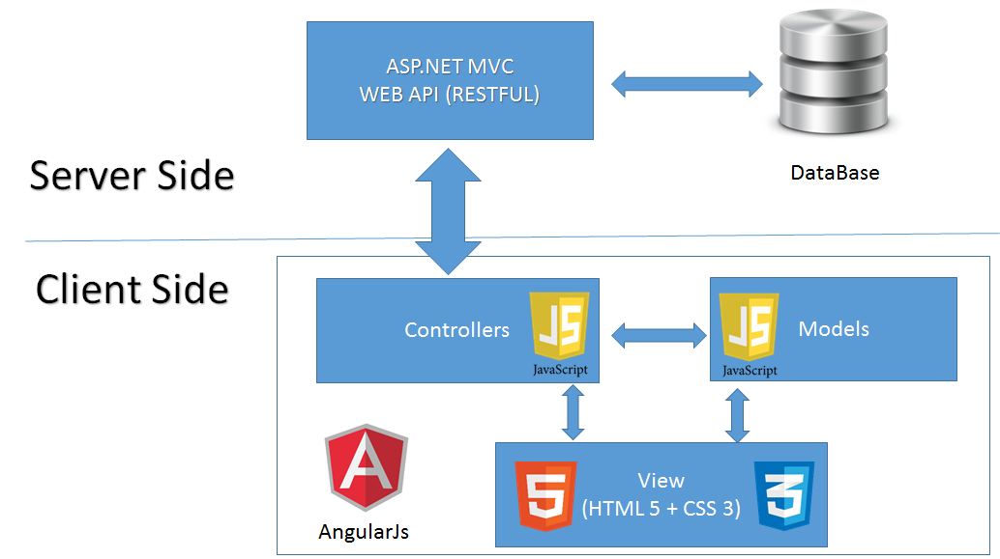
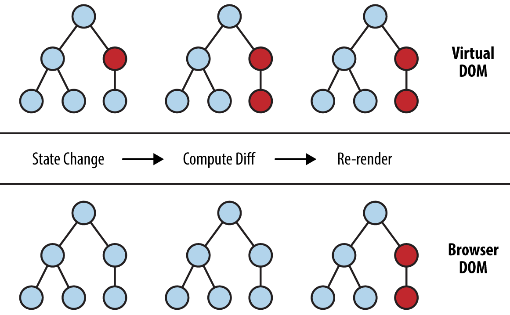
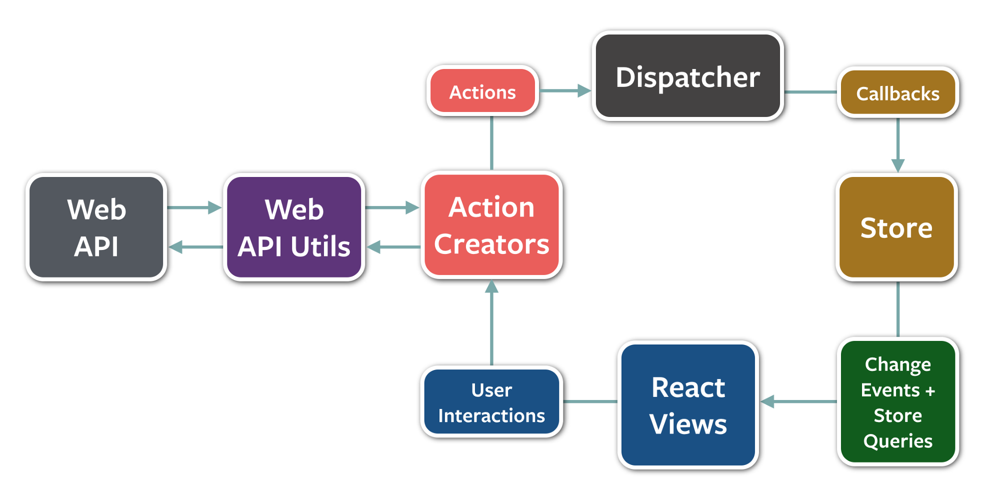

# A brief history of the web

::: notes
- motivation is to give a bit of context for client side web apps
- why has the industry settled on this methodology
- while writing this, young age of the modern web was put into perspective
:::

## Generation 1

Server rendered web pages

MVC becomes the de facto architecture

- 1995 - PHP
- 2005 - Ruby on Rails
- 2005 - Django

::: notes
- server responsible for rendering every page
- tight coupling between the backend and ui
  - monolithic
- MVC becomes the de facto architecture
:::

## Generation 1


::: notes
- relatively simple data flow
- request is routed through the controller
- model is queried
- view is sent in response
:::

## Generation 2

Client side apps

::: {.columns}
::: {.column width="50%"}
#### Web server frameworks
- 2010 - Flask
- 2010 - Express.js
:::
::: {.column width="50%"}
#### Client side web frameworks
- 2010 - Backbone.js
- 2011 - AngularJS
- 2011 - Ember.js
:::
:::

::: notes
- web browsers became more powerful
  - we begin to think about the browser as a platform itself
  - js became ubiquitous
- work from the server was offloaded to the client as a result
- server side dynamic was changing
  - microservices, approx 2005 - Borg, 2010 - Mesos, 2012 - Eureka / Hystrix
- required the view to be separate from the server side logic
- idea of a SPA was created as entire web apps could be created from a single
  page
  - MVC architecture on the front end
  - client side routing
:::

## Generation 2



::: notes
- unlike server side mvc, model is backed by a server over the network
:::

## Generation 2 - Problems

- Traditional MVC does not scale on the client side
- State management is complex
  - the model and view may be desynchronized
  - user actions may have a significantly greater amount of effects

::: notes
- MVC client side apps are difficult to maintain
  - do not scale
  - cannot use the same approach as with completely server rendered apps
  - not just a single output of html to the browser
- in particular state management becomes overly complex
  - need to ensure that the view reflects the model
  - easy to forget or lose track of what should be updated
  - effects of a user action may be numerous
    - e.g. entering a comment on a post of a hypothetical website
    - add a comment to the list of comments
    - update the comment count of the post
    - show that you are now following the post
:::

## Generation 2 - Problems


::: notes
- a certain change in the model could have many side effects
- AngularJS was notorious for being non-performant, because of dirty checking
  to keep the model and view in sync
:::

# Generation 3

::: notes
- due to the fast pace of the web, solutions were quickly created
:::

## React

- Kickstarted the componentization craze
  - Focused on reusability
- View should be a function of app state
  - Virtual DOM

::: notes
- FB 2013
- no longer thinking in terms of templating or pages
  - breaking down an app into reusable components
  - it is easy to make a change to a component and see it reflected across the
    entire application
- key principle is view is a pure function of the application state
  - traditional MVC saw changes to app state as mutations which are hard to
    keep track of
  - react just rerenders the entire view
  - implemented using a virtual dom
    - key benefit is that you do not have to perform a manual diff
    - react does one for you
  - solves the previous issue that the view needs to be synchronized with the
    model
:::

## React - Virtual DOM



::: notes
- virtual dom is a representation of the current dom in js
  - when a change is made, the vdom is updated
  - the vdom is diffed against its previous version
  - all the changed nodes get updated in the dom
- gives react a performance advantage
  - expensive dom manipulations are minimized
:::

## React - Code Example

```js
class ShoppingList extends React.Component {
  render() {
    return <div className="shopping-list">
      <h1>Shopping List for {this.props.name}</h1>
      <ul>
        <li>Instagram</li>
        <li>WhatsApp</li>
        <li>Oculus</li>
      </ul>
    </div>;
  }
}

// Example usage: <ShoppingList name="Mark" />
```

::: notes
- react code
- just a function
  - takes in a prop name
  - declarative code
  - no mutations
  - generates vdom
  - if it does change, react will take care of updating the actual dom
- syntax is jsx, which gets transpiled to es5
:::

## Redux

- De facto state management framework for React
- "One way data flow"

::: notes
- react is just a function
  - facebook did not provide a framework to manage that data
  - needs a solution to manage data
- one way data flow architecture
  - mvc done right
  - solves the issue of a spiderweb of dependencies
:::

## Redux



::: notes
- since react is a function of state, redux just focuses on state
- the single source of truth for data is in the STORE
- react takes that data and renders a view
- any change of the state must be defined as an ACTION
- action is dispatched to the STORE
- in the store, a pure function, the REDUCER, produces a new state from the old
  state and the action
- the changes are reflected in the view when react rerenders
:::

## Redux - Code Example

```js
// action types
export const ADD_TODO = 'ADD_TODO'
export const TOGGLE_TODO = 'TOGGLE_TODO'

// action creators
export function addTodo(text) {
  return { type: ADD_TODO, text }
}

export function toggleTodo(index) {
  return { type: TOGGLE_TODO, index }
}
```

::: notes
- just a plain object
- description of the change to the state
:::

## Redux - Code Example

```js
import {
  ADD_TODO,
  TOGGLE_TODO,
} from './actions'

export default function todos(state = [], action) {
  switch (action.type) {
    case ADD_TODO:
      return [...state,
        {
          text: action.text,
          completed: false
        }
      ];
    case TOGGLE_TODO:
      return state.map((todo, index) => {
        if (index === action.index) {
          return Object.assign({}, todo, {
            completed: !todo.completed
          });
        }
        return todo;
      })
    default:
      return state;
  }
}
```

::: notes
- just a simple function
- takes an action which is a description of state change
- returns a new state with the action's change
:::

## Overview


::: notes
- entire data flow through a react redux app
- recap:
  - React is just a function that turns state into a vdom
  - Actions are dispatched by the user to specify what change to make
  - Dispatch communicates an action to the store
  - Reducer generates a new state from the current and the action
  - Connect maps the redux state onto props
- benefits:
  - react keeps view in sync with state
  - easy to communicate between different components
    - say a button opens up a chat window
  - just need to update a single authoritative state
:::

# Generation 3.5

## React Native

- React for mobile apps
- Compile React to native ui

::: notes
- building universal apps
- many different target platforms with a single code base
:::

## Web components

- Custom component api
- Unopinionated
  - Can be used in conjunction with a framework such as React
- Polymer

::: notes
- custom components implemented using a shadow dom
- unopinionated
  - just a way to build reusable components
  - currently being used by youtube
- polymer, built by google, polyfills for the web component api
:::

## Any Questions?
